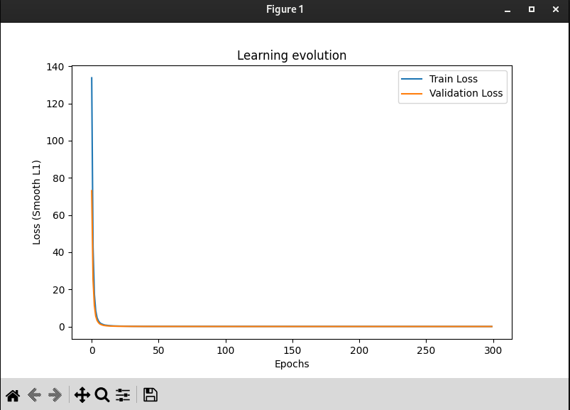

# 🏎️ Robocar - Epitech Lille

This repository contains the first stage of the **Robocar** project for the **Epitech Lille** campus.

It focuses on building a **supervised learning AI agent** capable of driving a car inside a Unity-based racing simulator.  
This simulator uses the **same parameters and sensor configuration** (LiDAR) as the future physical miniature car that we will receive for the second stage of the project.

The goal of this phase is to train and evaluate an AI model that can navigate a racetrack quickly and accurately using simulated sensor data — preparing the way for deployment on real hardware.

## ⚙️ Tools & Libraries

This project relies on a minimal but effective stack of technologies:

- **PyTorch**  
  Used to define and train the neural network model that controls the car.  
  PyTorch was chosen for its flexibility, active ecosystem, and ease of debugging during model development.  
  It allows fast iteration and supports advanced features like gradient clipping and learning rate scheduling.

- **matplotlib**  
  Used to visualize the training and validation loss across epochs.  
  This helps in quickly evaluating how well the model is learning and identifying signs of underfitting or overfitting.

- **pynput**  
  Used during the manual data collection phase.  
  It enables real-time capture of mouse and keyboard inputs to record acceleration and steering actions in the simulator.  
  This library makes it easy to implement intuitive and responsive control systems for driving the virtual car.

## 🧠 Model Design & Learning Strategy

We chose to build a **neural regression model** using PyTorch, trained to predict the car’s next action (acceleration and steering) based solely on LiDAR input.

## 🧪 Data Processing

The dataset is created manually using `manual.py`, where the user drives the virtual car inside the simulator using the mouse as a **joystick**:
- Horizontal movement controls **steering**
- Vertical movement controls **acceleration**

This input system makes it intuitive and responsive to drive, simulating a real controller.

Recording is not automatic: the user must press the **`R` key** to start or stop data recording.  
This design choice allows the user to record only the **best driving moments**, while avoiding:
- Mistakes
- Crashes
- Idle or uninteresting states

As a result, the collected dataset is **clean and high-quality**, containing only **relevant, human-filtered examples** of good driving behavior.

Each recorded data sample includes:
- A vector of **normalized LiDAR sensor readings** in `[0, 1]`
- A pair of control values: `[acceleration, steering]` in `[-1, 1]`

This data is then used for training the model, after being normalized again if necessary for stability during learning.

## 📊 Training & Evaluation

Training is handled by the `dojo.py` script, which loads the recorded dataset and trains the neural network using a supervised learning approach.

The dataset is split into:
- **95% for training**
- **5% for validation**

We use the **Smooth L1 Loss** to compute the difference between the predicted and expected outputs (acceleration and steering).

To prevent overfitting and improve generalization:
- **Dropout** (20%) is applied during training
- A **validation set** is used to monitor real performance on unseen data

At the end of the training, a graph is generated showing:
- The **training loss**
- The **validation loss**
across all epochs, helping us identify underfitting or overfitting.

> Example of loss plot:


## 📁 Project Structure

The project is organized into several scripts and modules, each with a specific role:

| File / Folder           | Description                                                                 |
|--------------------------|-----------------------------------------------------------------------------|
| `manual.py`             | Script for manually driving the car with mouse and recording clean data     |
| `dojo.py`               | Supervised training script using the recorded dataset                       |
| `auto.py`               | Launches the trained AI in the Unity simulator                              |
| `agent.py`              | Defines the neural network architecture (PyTorch)                           |
| `settings.py`           | Central configuration file (paths, constants, hyperparameters, etc.)        |
| `create_env.sh`         | Bash script to create a virtual Python environment with all dependencies     |
| `module/data_bufferNR.py` | Utility to normalize and store training data in CSV format               |
| `data_nr/`              | Folder where CSV driving data is saved after collection                     |
| `model/`                | Folder where trained `.pth` models are stored                               |
| `RacingSimulator/`      | Unity racing simulator binary                                              |
| `G-CAR-000-Robocar-Racing-Simulator.pdf` | Simulator subject and location to install simulators        |

> ⚠️ The folders `venv/`, `__pycache__/`, and `agent_config.json` are excluded via `.gitignore`.

---

# 🚀 How to Run the Project

This section explains how to set up and run the Robocar Racing Simulator from scratch.

## 🎮 0. Setup the Unity Racing Simulator

Before running any script, make sure the official **Robocar Racing Simulator** is correctly installed.

1. Download the simulator from the official subject (provided by Epitech)

```bash
RacingSimulator/
```

3. Inside that folder, the Unity build should be located at:

```bash
RacingSimulator/Build/RacingSimulator.x86_64
```

This default path is already configured in the project via `settings.py`.

If you're using another OS or the build is located elsewhere,  
you can update the simulator path directly in the `SIMULATOR_PATHS` section of:

```bash
settings.py
```

## 🧱 1. Create the Python environment
Use the provided script to create and activate a virtual environment:
```bash
./create_env.sh
source venv/bin/activate
```
This will install all required Python dependencies (PyTorch, matplotlib, mlagents, etc.).

## 🕹️ 2. Collect training data manually
Launch the simulator with manual control:
```bash
python3 manual.py
```
or
```bash
sudo -E python3 manual.py
```
⚠️ sudo -E is sometimes required to properly access mouse and keyboard events via pynput, especially on Linux.

During manual driving:

- The mouse acts like a **joystick**:
  - Horizontal movement controls **steering**
  - Vertical movement controls **acceleration**
- The program tracks the **mouse position across the entire screen**, not just inside the simulator window.

**Controls:**
- Press **`R`** to start or stop data recording
- Press **`Q`** to exit the simulator

Only the moments recorded while `R` is active are saved to the dataset (`data_nr/` folder).  
This ensures that your dataset contains only **clean and intentional driving behavior**, avoiding mistakes and noise.

## 🧠 3. Train the AI model

Once your dataset has been recorded and saved in the `data_nr/` folder, you can train the model using the `dojo.py` script.

```bash
python3 dojo.py data_nr/your_dataset.csv
```

This will:
- Load the CSV dataset (LiDAR input + recorded control values)
- Train the model using a neural network with 5 layers and dropout regularization
- Save the trained model to the `model/` folder (default: `model/nr_model.pth`)
- Display a **graph showing training and validation loss over time**

> You can adjust training parameters like learning rate, batch size, number of epochs, etc.  
> All configuration is centralized in `settings.py`.

## 🤖 4. Run the trained model

Once your model is trained, you can launch the Unity simulator and let the AI drive the car automatically using:

```bash
python3 auto.py model/nr_model.pth
```

This script will:
- Launch the simulator
- Load the latest trained model from the `model/` folder
- Feed LiDAR data into the network
- Apply the predicted actions (acceleration and steering) in real time

Make sure the simulator window is visible and in focus.

---

### 💡 Performance tip

For smoother execution and higher frame rate, we recommend:
- **Disabling raycast visuals** in the simulator
- **Turning off the background decor** (mountains, trees, etc.)

This reduces the load on your system and helps the AI run in real time with better responsiveness.


## ✅ Final Model & Team

The folder `model_rendu/` contains our final trained AI model.  
This model has been tested and successfully drives the car across **all tracks** in the Unity simulator.

To try it directly:

```bash
python3 auto.py model_rendu/nr_model.pth
```

No need to collect or train — the model is ready to run.

---

### 👥 Team Members

This project was developed by the **Robocar Epitech Lille** team:

| Name                                       | Role                  |
|--------------------------------------------|-----------------------|
| [Nicolas Dumetz](mailto:nicolas.dumetz@epitech.eu)         | Project Manager         |
| [Charles Faudou](mailto:charles.faudou@epitech.eu)         | Lead Developer          |
| [Thomas Baruzier](mailto:thomas.baruzier@epitech.eu)       | Software Specialist     |
| [Enzo Dubeaurepaire](mailto:enzo.dubeaurepaire@epitech.eu) | Consultant Strategy     |
| [Matisse Dufour](mailto:matisse.dufour@epitech.eu)         | Consultant Strategy     |

---


